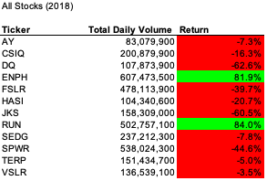
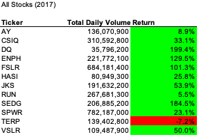
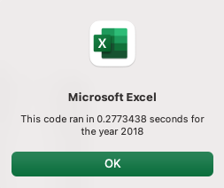
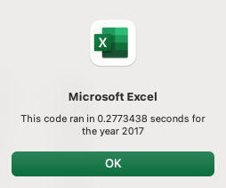
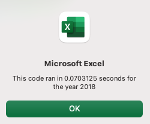
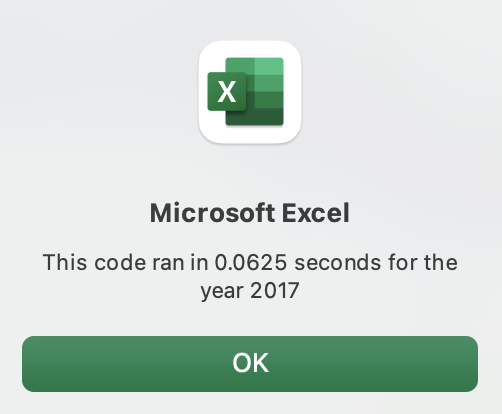

# Clean Energy Stock Analysis

*Foray into stock analysis, VBA, and refactoring code*

# Overview of Project

## Purpose
Stock data is analyzed using a macro to determine which stocks Steve's parents should invest in.
Steve wants to find the total daily volume and yearly return for each stock. Daily volume indicates how active a stock is traded. Annual return shows how effective the stock is as an investment. 

The macro will be activated by a button on the tab "All_Stocks_Analysis".
The user will be prompted to enter in the year he would like to perform the analysis on, and the tab will update accordingly.
The returns will be visually enhanced such that stocks with positive returns will be highlighted in green, and stocks with negative returns will be highlighted in red. 

After the initial analysis, the code will be refactored to loop through the data one time only while collecting the same information. 

## Background
There are two sets of data, one for each of the years 2017 and 2018. The stocks are a set of clean energy stocks. 
For each year, each stock has the following information available by day:
- Ticker
- Date
- Opening stock price
- Highest price during the Date
- Lowest price during the Date
- Closing stock price
- Adjusted Closing stock price
- Trading volume

# Results
The analysis is well described with screenshots and code (4 pt).

## Stock Performance
The 2018 and 2017 clean energy stocks had the following performances:

Steve's parents invested in DQ, which had 199.4% return in 2017. In 2018, the return was -62.6%, a dramatic decrease year over year. The total daily volume nearly tripled year over year. 

Looking at the rest of the clean energy stocks, the market as a whole underperformed in 2018 when comparing to 2017 performance. 2017 returns were almost entirely green across the board while 2018 is mostly red, with only two stocks, ENPH and RUN outperforming the market. Further research will be needed on the macro environments in 2017 and 2018 to make an informed decision. 

While not calculated in the macro output, the total volume for 2018 and 2017 in this set of stocks was 3,306,038,200 and 3,166,639,100, not representing a significant increase year over year. 

## Execution Times

The initial analysis and VBA code had the following run times for both years:

After refactoring the code, the run times for both years became:

This represens 

# Summary

## General Discussion Regarding Refactoring Code

### Advantages
1. Refactored code should be more efficient, using less memory.
2. Refactored code should be more clean and readable.

### Disadvantages
1. 
2. 
There is a detailed statement on the advantages and disadvantages of refactoring code in general (3 pt).

## Original vs Refactored VBA Script

### Advantages
1. 
2. 

### Disadvantages
1. 
2. 
There is a detailed statement on the advantages and disadvantages of the original and refactored VBA script (3 pt).
