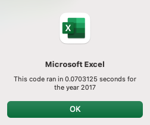

# Clean Energy Stock Analysis

*Foray into stock analysis, VBA, and refactoring code*

# Overview of Project

## Purpose
Stock data is analyzed using a macro to determine which stocks Steve's parents should invest in.
Steve wants to find the total daily volume and yearly return for each stock. Daily volume indicates how active a stock is traded. Annual return shows how effective the stock is as an investment. 

The macro will be activated by a button on the tab "All_Stocks_Analysis".
The user will be prompted to enter in the year he would like to perform the analysis on, and the tab will update accordingly.
The returns will be visually enhanced such that stocks with positive returns will be highlighted in green, and stocks with negative returns will be highlighted in red. 

After the initial analysis, the code will be refactored to loop through the data one time only while collecting the same information. 

## Background
There are two sets of data, one for each of the years 2017 and 2018. The stocks are a set of clean energy stocks. 
For each year, each stock has the following information available by day:
- Ticker
- Date
- Opening stock price
- Highest price during the Date
- Lowest price during the Date
- Closing stock price
- Adjusted Closing stock price
- Trading volume

# Results

## Stock Performance
The 2018 and 2017 clean energy stocks had the following performances:

Steve's parents invested in DQ, which had 199.4% return in 2017. In 2018, the return was -62.6%, a dramatic decrease year over year. The total daily volume for DQ nearly tripled year over year. 

Looking at the rest of the clean energy stocks, the market as a whole underperformed in 2018 when comparing to 2017 performance. 2017 returns were almost entirely green across the board while 2018 is mostly red, with only two stocks, ENPH and RUN outperforming the market. Further research will be needed on the macro environments in 2017 and 2018 to make an informed decision pon future investments. 

While not calculated in the macro output, the total volume for 2018 and 2017 in this set of stocks was 3,306,038,200 and 3,166,639,100, not representing a significant increase year over year. 

## Execution Times

The initial analysis and VBA code had the following run times for both years:

After refactoring the code, the run times for both years became:

The refactored run time represents a reduction in execution time by 75% compared to the previous VBA code. 

# Summary

## General Discussion Regarding Refactoring Code

### Advantages
1. Refactored code should be more efficient, using less memory. As shown in the next section below, it is optimal when the code can reduce the number of times a row has to be read. Similarly, reducing the number of variables that the system has to track will reduce the memory used. 

2. Refactored code should be more readable. The original code with nested loops can make the reader lose track of which loop they are in. Refactored code with blocks of code that are complete on its own will make it easier to make changes to variables and outputs. 

### Disadvantages
Refactoring code can be difficult to implement all the time. It is difficult to think outside the box and move away from the original logic. 

## Original vs Refactored VBA Script

### Advantages
In the original code, the logic is:

    For each ticker,
        Go through all the rows of data to check if ticker matches
        Get total volume, starting, and ending prices for this ticker
        Print out the results
    Do the same for the next ticker

For a data set containing 3,012 rows, and 12 tickers, the code is checking 3,012 x 12 = 36,144 rows.

In the refactored code, the logic is:

    For each row of data,
        If the ticker matches what we are currently checking, 
            Get total volume, starting, and ending prices for this ticker
        Move on to the next ticker and do the same

For the same data set, the code is checking each of the 3,012 row only one time - which is part of the reason why the refactored code run time is much faster. 

### Disadvantages
In both the original and refactored codes, the logic assumes that stock data for each stock is grouped together, and ordered based on the date. The starting and ending prices are prone to errors if the stock data is not organized in the exact way in future years. 